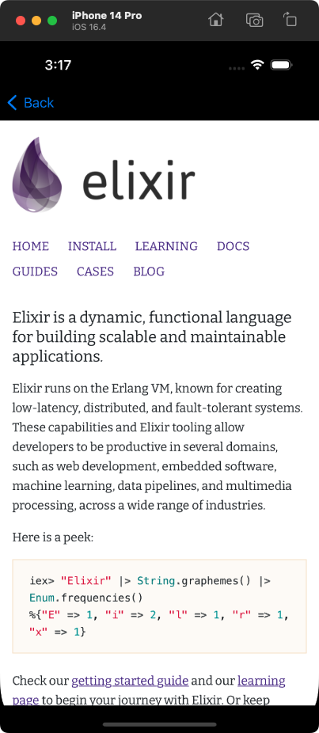

# liveview-native-webview

## About

`liveview-native-webview` is an add-on library for [LiveView Native](https://github.com/liveview-native/live_view_native). It allows rendering an embedded WebView within a native SwiftUI application built with LiveView Native.

## Usage

Add this library as a package to your LiveView Native application's Xcode project using its repo URL. Then, create an `AggregateRegistry` to include the provided `WebViewRegistry` within your native app builds:

```diff
import SwiftUI
import LiveViewNative
+ import LiveViewNativeWebView
+ 
+ struct MyRegistry: CustomRegistry {
+     typealias Root = AppRegistries
+ }
+ 
+ struct AppRegistries: AggregateRegistry {
+     typealias Registries = Registry2<
+         MyRegistry,
+         WebViewRegistry<Self>
+     >
+ }

@MainActor
struct ContentView: View {
-     @StateObject private var session: LiveSessionCoordinator<EmptyRegistry> = {
+     @StateObject private var session: LiveSessionCoordinator<AppRegistries> = {
        var config = LiveSessionConfiguration()
        config.navigationMode = .enabled
        
        return LiveSessionCoordinator(URL(string: "http://localhost:4000/")!, config: config)
    }()

    var body: some View {
        LiveView(session: session)
    }
}
```

To render a WebView within a SwiftUI HEEx template, use the `WebView` element with a `url`:

```elixir
defmodule MyAppWeb.WebViewLive do
  use Phoenix.LiveView
  use LiveViewNative.LiveView

  @impl true
  def render(%{platform_id: :swiftui} = assigns) do
    ~Z"""
    <VStack id="hello-ios">
      <WebView url="https://elixir-lang.org/" />
    </VStack>
    """swiftui
  end
end
```



## Learn more

  * Official website: https://native.live
  * Docs: https://hexdocs.pm/live_view_native_platform
  * Source: https://github.com/liveviewnative/live_view_native_platform
